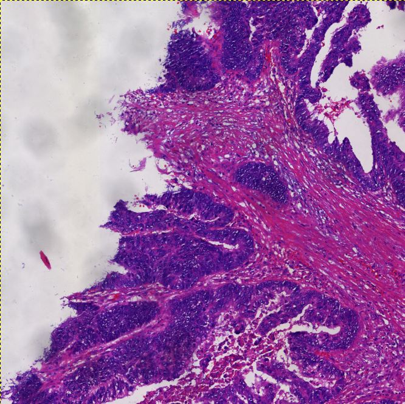
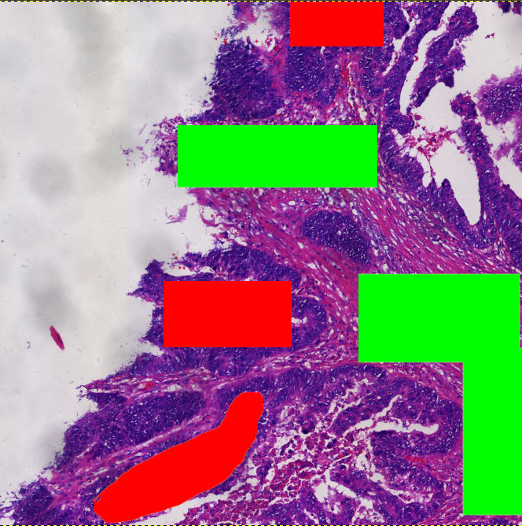
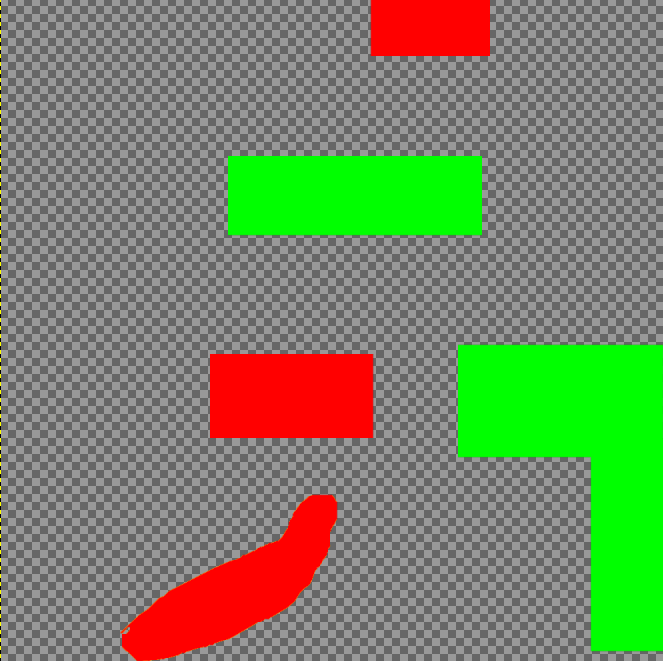

# Efficient-annotation-process-for-histopathological-images

## Introduction
This program is a high-efficiency annotation process for histopathological images. The junior pathologist can self-accumulate a large number of pixel-level annotations by this process. and shubmit them to the senior pathologist for final modification and confirmation as ground-truth for deep learning.

## Preparation

- You should download the pre-trained weight from [Baidu Netdisk](https://pan.baidu.com/s/1ZSjyrHIxSLqLt002XvI7gw?pwd=vlv7) (With code **vlv7**) and put it in fold **init_weights/**.
- And you should prepare your region of interests (ROIs) and put them in the fold XXX.
- Third, you should confirme the number of tissue types in your dataset and re-define your palette in **palette.py**, such as:
```
palette = [0]*100             # Palette for CRC dataset
palette[0:3] = [255,255,255]  # 0-Background
palette[3:6] = [120,120,120]  # 1-Normal
palette[6:9] = [255,0,0]      # 2-Tumor
palette[9:12] = [0,255,0]     # 3-Stroma
palette[12:15] = [0,255,255]  # 4-Mucus
palette[15:18] = [255,0,255]  # 5-Necrosis
palette[18:21] = [237,145,33] # 6-Muscle
```

## Requirement
- GIMAP program (Ubuntu) / Photoshop (Windows)
- GPU

## Usage

In this program, we show ehow to use this program on Ubuntu 20.04.

- Step 1: Generate simplest single-category annotation by drawing polygons or rectangular with the corresponding color of palette, such as:



- Step 2: Execute the script file by:
```
bash ./0_auto-loop.sh
```

- Step 3: 
